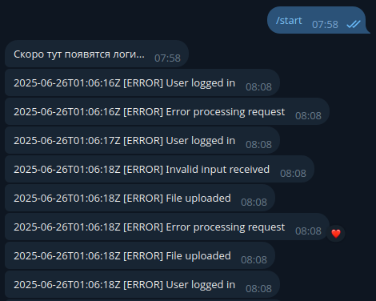
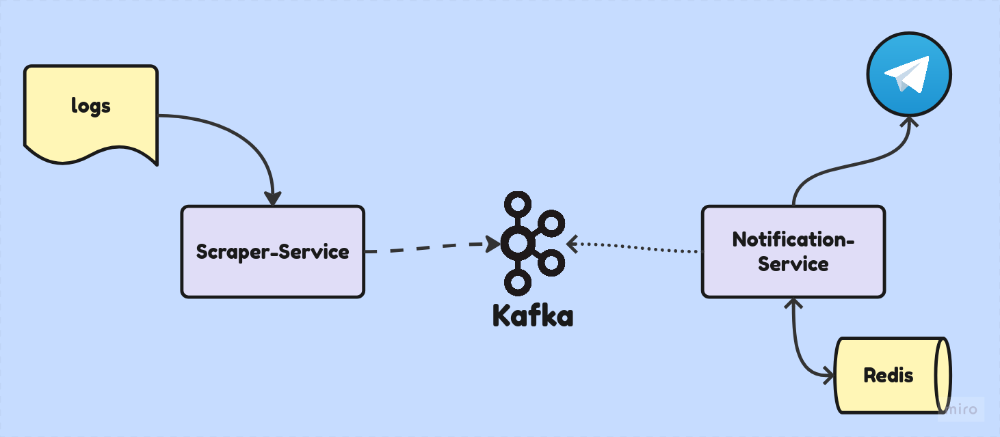

# Бот, отправляющий уведомления о выбранных логах

> - Считывает и фильтрует логи из файла;
> - Передаёт отфильтрованные записи в Kafka для буферизации;
> - Через чат-бота отправляет пользователю уведомления с содержанием логов.
---

- ### [**Быстрый старт**](#быстрый-старт)
- ### [**Пример работы**](#пример-работы)
- ### [**Архитектура**](#архитектура)

---

### Быстрый старт

#### Клонирование репозитория
```
git clone https://github.com/child6yo/logger-bot
cd logger-bot
```

#### Конфигурация (.env)
- Укажите токен вашего Telegram-бота в переменной NS_BOT_TOKEN
- При необходимости измените фильтр логов (регулярное выражение) через переменную SS_LOG_FILTER

#### Запуск приложения
```
docker-compose up
```

*При использовании dev-сборки файл logs.log будет создан автоматически (пример генерируется из example/task.go).
Обратите внимание: работа приложения начнётся не сразу — необходимо время на инициализацию сервисов Redis и Kafka.*

#### После запуска
- Откройте Telegram-бота и отправьте команду /start.

*Если всё настроено верно, вы получите сообщение: "Скоро тут появятся логи...".*

---

### Пример работы



---

### Архитектура

#### Основные компоненты

- **scraper-service**
```
    - Собирает и фильтрует логи из потока в файле
    - Отправляет отфильтрованные логи в Kafka для их сохранения
```
- **notification service**
```
    - Подписан на поток логов из буфера в Kafka
    - Сохраняет айди чатов, по которым будет рассылать логи в Redis
    - Рассылает приходящие логи по чатам
```

